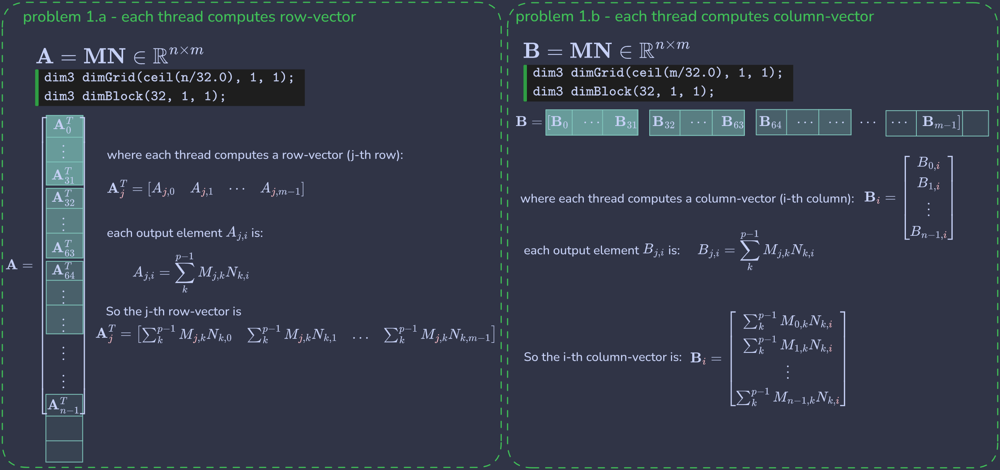

# Chapter 3 — Multidimensional Grids and Data
**Programming Massively Parallel Processors, 5th Edition**

---

## Summary

| # | Name | Concepts illustrated |
|---|------|----------------------|
| ... | [Notation](#notation) | We use *slow←fast* varying index (& corresponding dimension) notation | 
| Example 1 | [Color to greysclae](#color-to-greyscale) | Grid/block model, boundary conditions, per-thread pixel mapping |
| Example 2 | [Image blur](#image-blur) | 2D grid indexing, neighborhood access, RGB stride convention |
| Example 3 | [Matrix multiplication](#matrix-multiplication) | One output element per thread, row-major indexing, BLAS fundamentals |
| Exercise 1 | [Row/Column matmul variants](#exercise-1) | One output row or column per thread, coalescing tradeoffs |
| Exercise 2 | [Matrix-vector multiplication](#exercise-2) | Dot product per thread, 1D grid design |
| Exercise 3 | [Grid and block dimensions](#exercise-3) | Interpreting launch configs, counting total threads |
| Exercise 4 | [2D flat indexing](#exercise-4) | Row-major vs column-major element addressing |
| Exercise 5 | [3D flat indexing](#exercise-5) | Row-major addressing for rank-3 tensors |

---

## Notation
**for the rest of the book and repo!**

> [!IMPORTANT] 
> **Notation for R-rank tensors**
> 
> We will follow the subscript notation for a R-rank covariant tensor that expresses indexes from <mark>*right-to-left* (from *fast-to-slow varying index*)</mark>. Moreover, we'll be consistent in **both** CUDA code notation and mathematical expressions!
> 
> The generalized notation for addressing a R-rank tensor element with dimensions $T\in\mathbb{R}^{d_{R-1} \times \cdots \times d_1 \times d_0}$ (*slow←fast*) is via its indexes $T_{i_{R-1},\ldots,i_1,i_0}$ (*slow←fast*), respectively.
> 
> The generalized stride $s_k=\prod_{j=0}^{k-1}d_j$ is needed to compute the index in a row-major flattened tensor: $\text{flat(index)}=\sum_{r=0}^{R-1}i_rs_r$. For example:
> - 3D tensor $T\in\mathbb{R}^{d_2\times d_1\times d_0}$ element $T_{i_2,i_1,i_0}$ as row-major $T_{i_0 + i_1\times d_0 + i_2\times(d_0\times d_1)}$
> - 4D tensor $T\in\mathbb{R}^{d_3\times d_2\times d_1\times d_0}$ element $T_{i_3,i_2,i_1,i_0}$ as row-major $T_{i_0 + i_1\times d_0 + i_2\times(d_0\times d_1) + i_3\times(d_0\times d_1\times d_2)}$
> 
> Throughout the book we'll use variations of symbols depending on what kind of variables we're dealing with so here is a useful table (up to 4-rank tensors):
>
> | Mathematical<br>genearlized | Unspecific | Deep Learning | CUDA `threads` | 
> | :--- | :--- | :--- | :--- |
> | $i_0\in[0, d_0-1]$ (dim-0) | $i\in[0,m-1]$ (cols)   | $c\in[0,C-1]$ (channels) | `threadIdx.x` (block-width)  |
> | $i_1\in[0, d_1-1]$ (dim-1) | $j\in[0,n-1]$ (rows)   | $w\in[0,W-1]$ (width)    | `threadIdx.y` (block-height) |
> | $i_2\in[0, d_2-1]$ (dim-2) | $k\in[0,p-1]$ (depth)  | $h\in[0,H-1]$ (height)   | `threadIdx.z` (block-depth)  |
> | $i_3\in[0, d_3-1]$ (dim-3) | $l\in[0,q-1]$ (sample) | $n\in[0,N-1]$ (batch)    | NA | 


## Book Examples

### Color to greyscale 

For the first two examples we use the same input matrix (with rgb channels so technically a *3D tensor*) - Opeth's underrated Sorceress album cover


[color_to_grey.cu](color_to_grey.cu) shows how to get started with the grids and blocks GPU model using an example of converting a color image to greyscale. The problem introduces the use of boundary conditions in our kernel to account for excess threads larger than image pixels. We use [unspecific notation](#notation) with manual handling of the rgb channel dimension.


```cuda
__global__ void coloToGrayscaleConvertion(
    unsigned char *Pout,
    unsigned char *Pin,
    int width,
    int height) 
{
  int col = blockIdx.x * blockDim.x + threadIdx.x;
  int row = blockIdx.y * blockDim.y + threadIdx.y;

  if (col < width && row < height) {
    /* Get 1D offset for the greyscale output 
     * (pixel index of output flat matrix) 
     */
    int grayOffset = row * width + col;

    /* Input has 3x more dimensions due to rgb color channels */
    int rgbOffset = grayOffset * CHANNELS;

    /* Each pixel requires three bytes (one for each color channel) */
    /* OpenCV reads images as bgr so we need to account for that */
    unsigned char b = Pin[rgbOffset];     /* blue */
    unsigned char g = Pin[rgbOffset + 1]; /* green */
    unsigned char r = Pin[rgbOffset + 2]; /* red */

    /* Compute greys */
    Pout[grayOffset] = 0.299*r + 0.587*g + 0.114*b;
  }
}
```

### Image blur

[image_blur.cu](image_blur.cu) shows a more complex kernel that operates on an RGB color (3-strided) image. We use [Deep Learning notation](#notation) $H\times W\times C$ ($(h,w,c)$ *slow←fast* varying indexes, respectively) with the channel dimension as the faster varying index and height being the slower one. Each thread computes one output pixel by averaging all its neighborhood pixels within boundary conditions.


```cuda
__global__ void imageBlur(
    unsigned char* Pin,
    unsigned char* Pout,
    int W,
    int H,
    int blur_radii) 
{
  /* Deep Learning notation 
   * dimensions: H x W x C
   * indexes (slow←fast): (h, w, c)
   */
  int c = threadIdx.z; /* (b,g,r)=(0,1,2)$ */
  int w = blockIdx.x * blockDim.x + threadIdx.x; 
  int h = blockIdx.y * blockDim.y + threadIdx.y; 

  if (w < W && h < H) {
    int acc = 0;
    int pixels = 0; /* count number of pixels for averaging */

    for (int blurRow = -blur_radii; blurRow < blur_radii + 1; ++blurRow) {
      for (int blurCol = -blur_radii; blurCol < blur_radii + 1; ++blurCol) {
        int current_w = w + blurCol;
        int current_h = h + blurRow;

        if (current_w >= 0 && current_w < W && current_h >= 0 && current_h < H) {
          /* row-major indexing: Pin[h*(C*W) + w*C + c] */
          acc += Pin[current_h * (CHANNELS * W) + current_w * CHANNELS + c];
          ++pixels;
        }
      }
    }
    Pout[h * (CHANNELS * W) + w * CHANNELS + c] = (unsigned char)(acc / pixels);
  }
}
```

### Matrix multiplication 

[matrix_multiplication.cu](matrix_multiplication.cu) is the fundamental BLAS example. One output matrix element per thread. Each thread computes the dot product of one row of M and one column of N.

```cuda
__global__ void MatrixMulKernel(
    float* M,
    float* N,
    float* P,
    int height,
    int width)
{
  int col = blockIdx.x * blockDim.x + threadIdx.x;
  int row = blockIdx.y * blockDim.y + threadIdx.y;

  if (col < width && row < height) {
    float acc = 0;
    /* Compute P[j][i] = \sum_k^p M[j][k] * N[k][i] */
    for (int k = 0; k < width; ++k) {
      acc += M[row*width+k] * N[k*width+col];
    }
    P[row * width + col] = acc;
  }
}
```

---

## Exercises

### Exercise 1

[ch03_ex01.cu](ch03_ex01.cu) shows two kernel variants for matrix multiplication where $M\in\mathbb{R}^{n\times p}$ and $N \in \mathbb{R}^{p\times m}$:

- **1.a** — one thread computes an entire output row-vector `A[row][:]` $\leftarrow \left[\sum_k^{p-1} M_{\text{row},k}N_{k,0}, \ldots, \sum_k^{p-1} M_{\text{row},k}N_{k,m-1}\right]$
- **1.b** — one thread computes an entire output column-vector `B[:][col]` $\leftarrow \left[\sum_k^{p-1} M_{0,k}N_{k,\text{col}}, \ldots, \sum_k^{p-1} M_{n-1,k}N_{k,\text{col}}\right]^T$
- **1.c** - Neither is optimal. Both carry one uncoalesced access pattern. The tiled shared memory approach (Ch. 5) resolves this



```cuda
/* A - write a kernel that has each thread produce one output matrix row */
__global__ void matmulRowKernel(
    float* M, /* \in R^{n x p} */
    float* N, /* \in R^{p x m} */
    float* A, /* \in R^{n x m} */
    int m,
    int p,
    int n)
{
  int row = blockIdx.x * blockDim.x + threadIdx.x;

  if (row < n) {
    /* Compute output row-vector A[row][:] */
    /* populate all i-th (\in m) elements in row-vector A[row][:] = \sum_k^p M[row][k] * N[k][i] */
    for (int i = 0; i < m; ++i) {
      float acc = 0.0f;
      for (int k = 0; k < p; ++k) {
        acc += M[row * p + k] * N[k * m + i];
      }
      /* row-th row-vector A[row][:] */
      A[row * m + i] = acc;
    }
  }
}

/* B - write a kernel that has each thread produce one output matrix column */
__global__ void matmulColKernel(
    float* M,
    float* N,
    float* B,
    int m,
    int p,
    int n)
{
  int col = blockIdx.x * blockDim.x + threadIdx.x;

  if (col < m) {
    /* Compute output col-vector B[:][col] */
    /* populate all j-th (\in n) elements in col-vector B[:][col] = \sum_k^p M[j][k] * N[k][col] */
    for (int j = 0; j < n; ++j) {
      float acc = 0.0f;
      for (int k = 0; k < p; ++k){
        acc += M[j * p + k] * N[k * m + col];
      }
      /* col-th column-vector B[:][col] */
      B[j * m + col] = acc;
    }
  }
}
```

### Exercise 2
[ch03_ex02.cu](ch03_ex02.cu) kernel where each thread computes one full dot product between a square matrix row `B[row][:]` and the input vector `c`. Grid is 1D over the number of matrix rows.

```cuda
__global__ void matVecKernel(
    float* B,
    float* c,
    float* a,
    int n)
{
  int row = blockIdx.x * blockDim.x + threadIdx.x;

  if (row < n) {
    float acc = 0.0f;
    for (int j = 0; j < n; ++j) {
      acc += B[row * n + j] * c[j];
    }
    a[row] = acc;
  }
}
```

### Exercise 3

Given the following kernel and configuration execution parameters `bd(16,32)` & `gd(19,5)` (note that C/C++ drops the decimal part in integer division if no float is specified in `gd`), we have:
- *a)* 512 threads per block
- *b)* $\text{threads\/block} \times (\text{gridDim.x} \times \text{gridDim.y})=48640$ threads in the grid
- *c)* 95 grids
- *d)* The threads that execute the code in line `05` are $M\times N=45000$ (which means that there is 3640 inactive threads)

```cuda
__global__ void foo_kernel(float* a , float* b , unsigned int M, unsigned int N) {
    unsigned int row = blockIdx.y*blockDim.y + threadIdx.y;
    unsigned int col = blockIdx.x*blockDim.x + threadIdx.x;
    if(row < M && col < N) {
        b[row*N + col] = a[row*N + col]/2.1f + 4.8f;
    }
}
void foo(float* a_d , float* b_d) {
    unsigned int M = 150;
    unsigned int N = 300;
    dim3 bd(16 , 32);
    dim3 gd((N - 1)/16 + 1 , (M - 1)/32 + 1);
    foo_kernel <<<gd, bd>>>(a_d , b_d , M , N);
}
```

### Exercise 4

Given a 2D matrix $M\in\mathbb{R}^{n\times m}$ stored as a flat vector, express element `M[j][i]` in:

- **Row-major:** `M[j * m + i]`
- **Column-major:** `M[i * n + j]`

### Exercise 5

Given a 3D tensor $M\in\mathbb{R}^{p\times n\times m}$ in row-major order the leftmost index varies fastest, so the strides are:
- $k$ (depth) has stride $m \times p$
- $j$ (height) has stride $m$
- $i$ (width) has stride $1$

So the element `T[z=5][y=20][x=10]` of a $(p,n,m)=(300, 500, 400)$ tensor is accessed (in row-major) as `T[5*(400*500) + 20*400 + 10] = T[1008010]`
