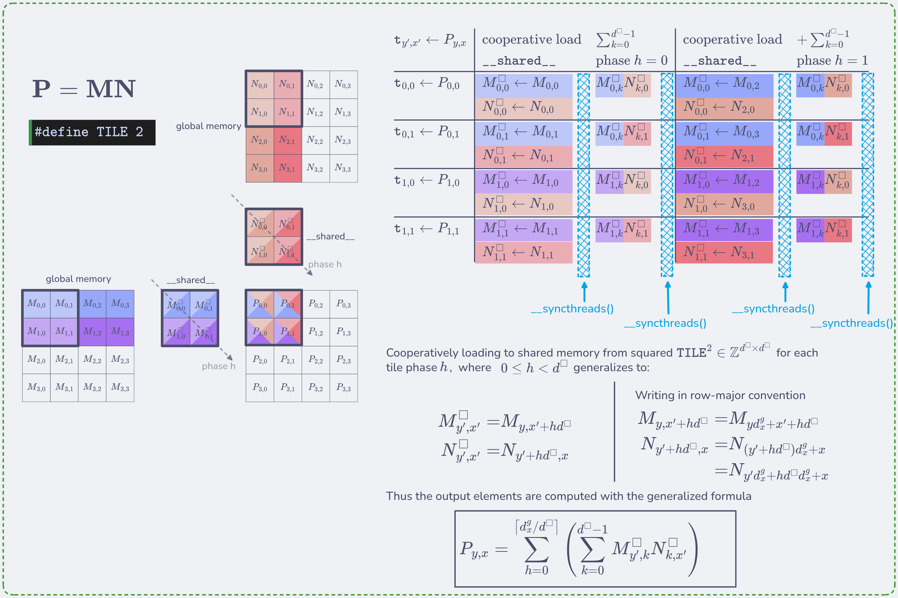
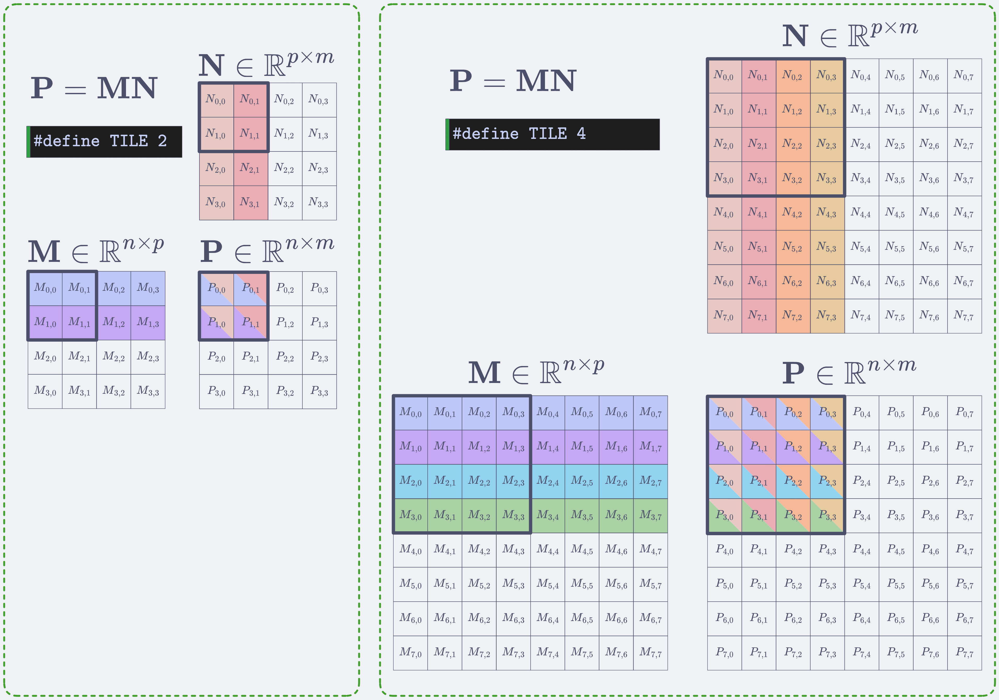

# Chapter 5 — Memory architecture and data locality
**Programming Massively Parallel Processors, 5th Edition**

---

## Summary

| # | Name | Concepts illustrated |
|---|------|----------------------|
| Example 1 | [Tiled matmul](#example-1) | Grid/block model, boundary conditions, per-thread pixel mapping |
| Exercise 1 | [Row/Column matmul variants](#exercise-1) | One output row or column per thread, coalescing tradeoffs |
| Exercise 2 | [Matrix-vector multiplication](#exercise-2) | Dot product per thread, 1D grid design |
| Exercise 3 | [Grid and block dimensions](#exercise-3) | Interpreting launch configs, counting total threads |
| Exercise 4 | [2D flat indexing](#exercise-4) | Row-major vs column-major element addressing |
| Exercise 5 | [3D flat indexing](#exercise-5) | Row-major addressing for rank-3 tensors |

---

## Book Examples

### Example 1


[tiled_matmul.cu](tiled_matmul.cu) improves on Chapter 3's matmul introducing *tiles* to reduce the number of reads from global memory. Tiles basically improve bandwidth by `TILE` dimension times by cooperatively loading a subset of input data to `__shared__` memory (scope is a thread block). The working logic is exemplified in the figure below



example of kernel:

```cuda
#define TILE 16

__global__ void SquareMatmulTiled(
    float* M,
    float* N,
    float* P,
    int n)
{
  __shared__ float Mds[TILE][TILE];
  __shared__ float Nds[TILE][TILE];

  int bx = blockIdx.x;  int by = blockIdx.y;
  int tx = threadIdx.x; int ty = threadIdx.y;

  int col = bx * TILE + tx;
  int row = by * TILE + ty;

  /* Loop over */
  float acc = 0.0f;
  for (int ph = 0; ph < ceil(n/(float)TILE); ++ph) {
    /* Collaborative loading of M, N 
     * boundary conditions for tiles
     */
    if (row < n && (ph*TILE + tx) < n) {
      Mds[ty][tx] = M[row*n + tx + ph*TILE];
    } else Mds[ty][tx] = 0.0f;

    if (col < n && (ph*TILE + ty) < n) {
      Nds[ty][tx] = N[(ty + ph*TILE)*n + col];
    } else Nds[ty][tx] = 0.0f;
    __syncthreads();

    for (int k = 0; k < TILE; ++k) {
      acc += Mds[ty][k] * Nds[k][tx];
    }
    __syncthreads();
  }
  /* Boundary conditions for output matrix */
  if (row < n && col < n) {
    P[row*n + col] = acc;
  }
}
```

---

## Exercises

### Exercise 1

Matrix addition is performed elelemt by element (in-place) therefore we can use shared memory to cooperatively load from tiles to reduce global memory bandwidth consumption if we change our thread configuration ie. one thread computes an entire column/row output vector. Otherwise, if we instruct a thread to produce one output element we cannot leverage shared memory usage.

### Exercise 2



### Exercise 3

If no `__syncthreads()` are placed after *(i)* cooperatively tile load step and *(ii)* output value accumulator calculation step for every phase; our code will fail *read-after-write & write-after-read dependences*. Meaning that:
- we could have incomplete tile loads like uninitialized values or zeroes in dynamically and statically sized tiles, respectively. 
- we could be writing corrupted values to any output element `accumulator`

### Exercise 4

Ignoring register and shared memory capacity limitations - shared memory is still beneficial because is shared accross all threads in the same block as opposed to registers which are evenly allocated accross all threads in SM. So even in the hypothetical case of registers having the capacity to store arbitrary-large variables these would have to be read from global memory for every thread which is expensive.

### Exercise 5

If we use a 32 x 32 tile in squared matmul the reduction of memory bandwidth is 32 for each M and N matrx dimensions.

### Exercise 6

Variables defined in local memory have thread-level scope so the 1000-block kernel will create such local variable 512000 times (512 times per thread per block).

### Exercise 7

Defining Exercise 6's varible from local to shared memory will make the program create such variable 1000 times (once every block).

### Exercise 8

Performing squared matmul of dimensions $N \times N$ every element of the input matrices is requested from gobal memory:
- **8.a.** $2N^2$ times without tiling.
- **8.b.** $3N^2/T$ with $T\times T$ tiling.

### Exercise 9

A kernel performs 36 FLOP and 7 4-Bytes global memory reads per thread. Given the following device properties at peak capacity:
- **9.a.** 200 GFLOPS & 100 GB/s - yields a *compute-intensity* of 2 FLOP/B 
- **9.b.** 300 GFLOPS & 250 GB/s - gives 1.2 FLOP/B *compute-intensity* 
