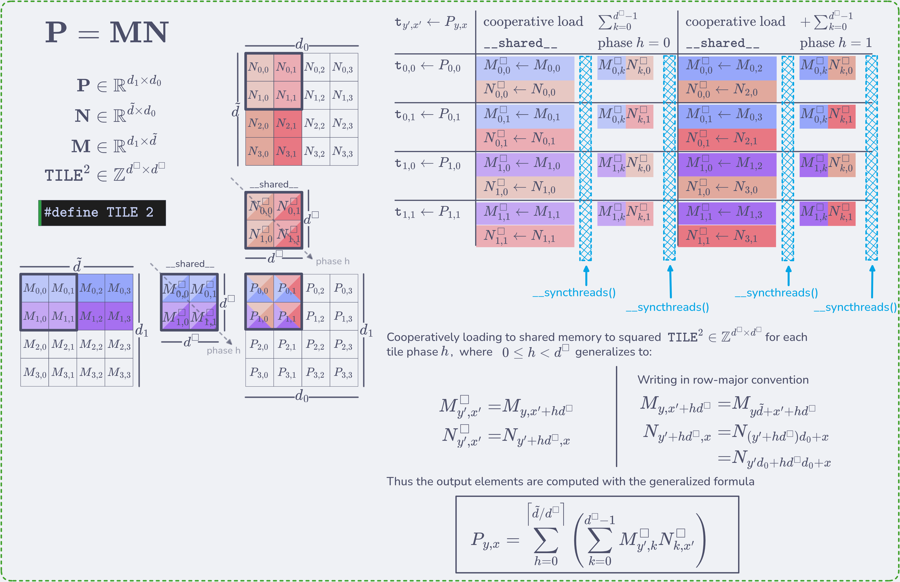
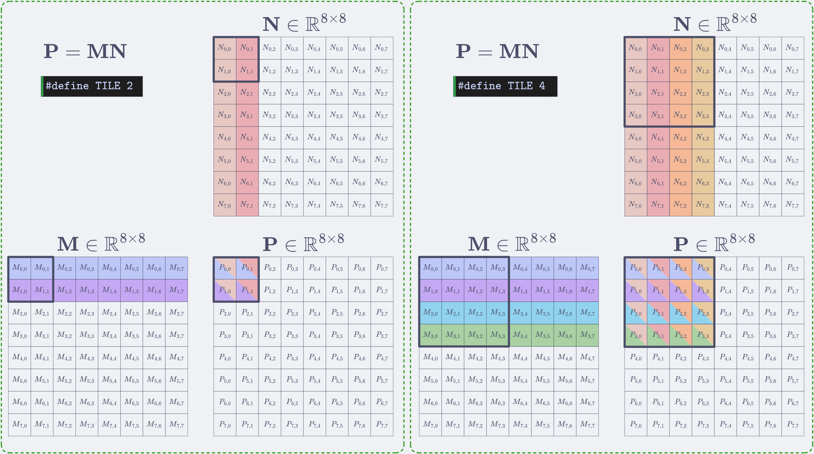
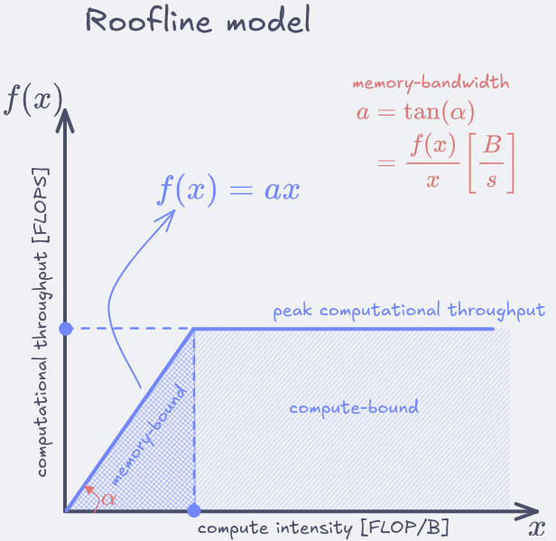

# Chapter 5 — Memory architecture and data locality
**Programming Massively Parallel Processors, 5th Edition**

---

## Summary

| # | Name | Concepts illustrated |
|---|------|----------------------|
| Example 1 | [Tiled matmul](#example-1) | Cooperative tiling for GEMM w/ static tile dimensions |
| Example 2 | [Matmul w/ dynamic tile dim](#example-2) | Cooperative tiling for GEMM w/ dynamic tile dimensions |
| Example 3 | [Matmul w/ optimal tile dim](#example-3) | Cooperative tiling for GEMM w/ optimal tile dimensions based on hardware limitations |
| Exercise 1 | [Matrix addition](#exercise-1) | Tiling in matrix addition gives no benefits |
| Exercise 2 | [Tiling drawings](#exercise-2) | 8x8 matmul with 2x2 & 4x4 tiling drawings exemplify the efficient memory read factor |
| Exercise 3 | [Importance of `__syncthreads()`](#exercise-3) | Ommiting `__syncthreads()` results in read-after-write & write-after-read failures |
| Exercise 4 | [Benefits of shared memory](#exercise-4) | Even if registers would have near infinite capacity shared memory is still benefitial |
| Exercise 5 | [Reduction of memory bandwidth](#exercise-5) | Reduction of global memory reads factor is the tile dimension |
| Exercise 6 | [Local variable declaration in kernel](#exercise-6) | Local variable scope is at thread-level |
| Exercise 7 | [Shared memory variable declaration in kernel](#exercise-7) | Variable loaded to shared memory has thread-block-level scope |
| Exercise 8 | [Memory bandwidth w/ & w/o tiling](#exercise-8) | Reduction of global memory reads factor is the tile dimension |
| Exercise 9 | [Compute- or memory-bound](#exercise-9) | Roofline model for determining compute-bound and/or memory bound regimes |
| Exercise 10 | [`__syncthreads()` missing](#exercise-10) | Code example with no `__syncthreads()` forces tile dimension > 1 to be inefective |
| Exercise 11 | [Computational throughput and memory bandwidth](#exercise-11) | Different variable scopes and compute-intensity [OPerations/Byte] |
| Exercise 12 | [Occupancy, kernels & hardware specs](#exercise-12) | Occupancy dependence on kernel specs and hardware limitations |

---

## Book Examples

### Example 1


[tile_matmul.cu](tile_matmul.cu) improves on Chapter 3's matmul introducing *tiles* to reduce the number of reads from global memory. Tiles basically improve bandwidth by `TILE` dimension times by cooperatively loading a subset of input data to `__shared__` memory (scope is a thread block). The working logic is exemplified in the figure below




example of kernel:

```cuda
#define TILE 16

__global__ void SquareMatmulTiled(
    float* M,
    float* N,
    float* P,
    int n)
{
  __shared__ float Mds[TILE][TILE];
  __shared__ float Nds[TILE][TILE];

  int bx = blockIdx.x;  int by = blockIdx.y;
  int tx = threadIdx.x; int ty = threadIdx.y;

  int col = bx * TILE + tx;
  int row = by * TILE + ty;

  /* Loop over */
  float acc = 0.0f;
  for (int ph = 0; ph < ceil(n/(float)TILE); ++ph) {
    /* Collaborative loading of M, N 
     * boundary conditions for tiles
     */
    if (row < n && (ph*TILE + tx) < n) {
      Mds[ty][tx] = M[row*n + tx + ph*TILE];
    } else Mds[ty][tx] = 0.0f;

    if (col < n && (ph*TILE + ty) < n) {
      Nds[ty][tx] = N[(ty + ph*TILE)*n + col];
    } else Nds[ty][tx] = 0.0f;
    __syncthreads();

    for (int k = 0; k < TILE; ++k) {
      acc += Mds[ty][k] * Nds[k][tx];
    }
    __syncthreads();
  }
  /* Boundary conditions for output matrix */
  if (row < n && col < n) {
    P[row*n + col] = acc;
  }
}
```

### Example 2

[dynamic_tile_matmul.cu](dynamic_tile_matmul.cu) improves on [tile_matmul.cu](tile_matmul.cu) by declaring one contiguous dynamically allocated tile variable for cooperative loading both M and N matrices. 

```cuda
#define TILE 32

__global__ void matmulKernel(
    float* M,
    float* N,
    float* P,
    int d0,
    int d_,
    int d1)
{
  extern __shared__ float Tld[];

  float *Mds = (float *) Tld;
  float *Nds = (float *) Tld + (TILE * TILE); /* Is valid for pointer arithmetic offset operands 
                                               * which basically is handled by the compiler as
                                               * Nds = address_of_Tld + (TILE * TILE * sizeof(float))
                                               */

  /* relative indexes ty, tx (wrt blocks) 
   * absolute indexes y, x 
   */
  int tx = threadIdx.x; int bx = blockIdx.x;
  int ty = threadIdx.y; int by = blockIdx.y;

  int x = tx +  bx * TILE;
  int y = ty +  by * TILE;

  /* Iterate for each tile phase */
  float acc = 0.0f;
  for (int h = 0; h < ceil(d_/(float)TILE); ++h) {
    /* load to Mds, Nds tile w/ boundary checks */
    if (y < d1 && (h*TILE + tx) < d_) {
      Mds[tx + ty*TILE] = M[tx + h*TILE + y*d_];
    } else Mds[tx + ty*TILE] = 0.0f;

    if ((h*TILE + ty) < d_ && x < d0) {
      Nds[tx + ty*TILE] = N[x + (ty + h*TILE)*d0];
    } else Nds[tx + ty*TILE] = 0.0f;
    __syncthreads();

    for (int k = 0; k < TILE; ++k) {
      acc += Mds[k + ty*TILE] * Nds[tx + k*TILE];
    }
    __syncthreads();
  }

  /* Boundary check for output matrix */
  if (x < d0 && y < d1) {
    P[x + y*d0] = acc;
  }
}
```

### Example 3

[optimal_tile_matmul.cu](optimal_tile_matmul.cu) improves on [dynamic_tile_matmul.cu](dynamic_tile_matmul.cu) by calling [device_properties.cuh](device_properties.cuh) helper script to automatically compute the optimal tile dimension based on the hardware available.  

---

## Exercises

### Exercise 1

Matrix addition is performed elelemt by element (in-place) therefore we can use shared memory to cooperatively load from tiles to reduce global memory bandwidth consumption if we change our thread configuration ie. one thread computes an entire column/row output vector. Otherwise, if we instruct a thread to produce one output element we cannot leverage shared memory usage.

### Exercise 2



### Exercise 3

If no `__syncthreads()` are placed after *(i)* cooperatively tile load step and *(ii)* output value accumulator calculation step for every phase; our code will fail *read-after-write & write-after-read dependences*. Meaning that:
- we could have incomplete tile loads like uninitialized values or old values in dynamically and statically-sized tiles, respectively. 
- we could be writing corrupted values to any output element `accumulator`

### Exercise 4

Assuming register and shared memory capacity limitations were not an issue - *shared memory* is still beneficial because is shared accross all threads in the same block as opposed to registers which are evenly allocated accross all threads in SM. So even in the hypothetical case of registers having the capacity to store arbitrary-large variables these would have to be read from global memory for every thread which is expensive.

### Exercise 5

If we use a 32 x 32 tile in squared matmul the reduction of memory bandwidth is 32 for a $M \times N$ matrix.

### Exercise 6

Variables defined in local memory have thread-level scope so the 1000-block kernel will create such local variable 512000 times (512 times per thread per block).

### Exercise 7

Declaring Exercise 6's local-variable into shared memory will make the program create such variable 1000 times (once every thread-block).

### Exercise 8

Performing squared matmul of dimensions $N \times N$ every element of the input matrices is requested from gobal memory:
- **8.a.** $2N^2$ times without tiling.
- **8.b.** $2N^2/T$ with $T\times T$ tiling.

### Exercise 9

A kernel performs 36 FLOP and 7 4-Bytes global memory reads per thread which gives a *compute-intensity* of

$$
\frac{36 \text{ FLOP}}{7\times 4 \text{ B}} = 1.29 \text{ FLOP/B}
$$



Given the following device properties at peak capacity:
- **9.a.** 200 GFLOPS & 100 GB/s - yields a *compute-intensity* of $2 \text{ FLOP/B}(> 1.29 \text{ FLOP/B})$ which indicates that the kernel is *memory-bound*.
- **9.b.** 300 GFLOPS & 250 GB/s - gives $1.2 \text{FLOP/B}(< 1.29 \text{ FLOP/B})$ *compute-intensity* so the kernel is *compute-bound*.

### Exercise 10

```cuda
dim3 blockDim(BLOCK_WIDTH, BLOCK_WIDTH);
dim3 gridDim(A_width/blockDim.x, A_height/blockDim.y);
BlockTranspose<<<gridDim, blockDim>>>(A, A_width, A_height)

__global__ void
BlockTranspose(float* A_elements, int A_width, int A_height)
{
  __shared__ float blockA[BLOCK_WIDTH][BLOCK_WIDTH];

  int baseIdx = blockIdx.x * BLOCK_SIZE + threadIdx.x;
  baseIdx += (blockIdx.y * BLOCK_SIZE + threadIdx.y) * A_width;

  blockA[threadIdx.y][threadIdx.x] = A_elements[baseIdx];
  
  A_elements[baseIdx] = blockA[threadIdx.x][threadIdx.y];
}
```

As we've seen in [Exercise 3](#exercise-3) **10.b.** if we ommit a `__syncthreads()` after cooperative tile loading to `__shared__` memory, then we're making our code vulnerable to *read-after-write* failures. **10.a.** Thus, the code will only run with guarantees for `BLOCK_WIDTH = 1` 

### Exercise 11

```cuda
 1 __global__ void foo_kernel(float* a, float* b) {
 2   unsigned int i = blockIdx.x*blockDim.x + threadIdx.x;
 3   float x[4];
 4   __shared__ float y_s;
 5   __shared__ float b_s[128];
 6   for (unsigned int j = 0; j < 4; ++j) {
 7     x[j] = a[j*blocks.x*gridDim.x + i];
 8   }
 9   if (threadIdx.x == 0) {
10     y_s = 7.4f;
11   }
12   b_s[threadIdx.x] = b[i];
13   __syncthreads();
14   b[i] = 2.5f*x[0] + 3.7f*x[1] + 6.3f*x[2] + 8.5f*[3]
15          + y_s*b_s[threadIdx.x] + b_s[(threadIdx.x + 3)%128];
16 }
17 void foo(int* a_d, int* b_d) {
18   unsigned int N = 1024;
19   foo_kernel <<< (N + 128 - 1)/128, 128 >>>(a_d, b_d);
20 }
```

- **11.a.** - there are `gridDim.x * blockDim.x = 8 * 128 = 1024` threads and versions of `i` in total.
- **11.b.** - one `x[]` per thread so 1024.
- **11.c.** - there are as many versions of `y_s` as thread blocks → 128.
- **11.d.** - one shared memory `y_s` per thread block so 128.
- **11.e.** - the amount of used shared memory per thread block is `sizeof(y_s) + sizeof(b_s) = 4 B + (128 * 4) B = 516 B`.
- **11.f.** - to obtain the floating point to global memory access ratio of the kernel (in OP/B) we need to count both number of operations and number of memory reads:
    - *bandwidth* - every thread performs one global memory read for `b_s[threadIdx.x] = b[i];` then two memory reads in `b[i] = ... + y_s*b_s[threadIdx.x] + b_s[(threadIdx.x +  3)%128];` 

### Exercise 12

Conisder a GPU with the following limits: 2048 threads/SM, 32 blocks/SM, 64 K (65536) registers/SM & 96 KB of shared-memory/SM. For each of the following kernel characteristics specify if full occupancy is posible, otherwise specify the limiting factor:
- **12.a.** - The kernel uses 64 threads/block, 27 registers/thread & 4 KB shared-memory/SM. We have to check if these characteristics are below the limit or if they need to be capped:

$$
\begin{align*}
&2048\frac{\text{threads}}{\text{SM}} \times 27 \frac{\text{registers}}{\text{thread}} = 55296 \frac{\text{registers}}{\text{SM}} && \left(\leq 65536 \frac{\text{registers}}{\text{SM}} \right) \\
&32 \frac{\text{blocks}}{\text{SM}} \times 4 \text{KB} \frac{\text{shared-mem}}{\text{block}} = 128 \text{KB} \frac{\text{shared-mem}}{\text{SM}} && \left(\nleq 96 \text{KB} \frac{\text{shared-mem}}{\text{SM}}\right) \\
&\rightarrow\frac{1}{4\text{KB}} \frac{\text{SM}}{\text{shared-mem}} \times 96 \text{KB} \frac{\text{shared-mem}}{\text{SM}} = 24 \frac{\text{blocks}}{\text{SM}} && \left(\text{capped}\right) \\
&64 \frac{\text{threads}}{\text{block}} \times 24 \frac{\text{blocks}}{\text{SM}} = 1536 \frac{\text{threads}}{\text{SM}} && \left(\leq 2048 \frac{\text{threads}}{\text{SM}}\right)\\
\end{align*}
$$

due to the blocks/SM cap the kernel reaches $1536/2048 \times 100 = 75$% occupancy.

- **12.b.** - The kernel uses 256 threads/block, 31 registers/thread & 8 KB shared-memory/SM. Simiar to *12.a.*

$$
\begin{align*}
&256 \frac{\text{threads}}{\text{block}} \times 32 \frac{\text{blocks}}{\text{SM}} = 8192 \frac{\text{threads}}{\text{SM}} && \left(\nleq 2048 \frac{\text{threads}}{\text{SM}}\right)\\
&\rightarrow\frac{1}{256} \frac{\text{block}}{\text{threads}} \times 2048\frac{\text{threads}}{\text{SM}} = 8 \frac{\text{blocks}}{\text{SM}} && \left(\text{capped}\right)\\
&2048\frac{\text{threads}}{\text{SM}} \times 31 \frac{\text{registers}}{\text{thread}} = 63488 \frac{\text{registers}}{\text{SM}} && \left(\leq 65536 \frac{\text{registers}}{\text{SM}} \right) \\
&8 \frac{\text{blocks}}{\text{SM}} \times 8 \text{KB} \frac{\text{shared-mem}}{\text{block}} = 64 \text{KB} \frac{\text{shared-mem}}{\text{SM}} && \left(\leq 96 \text{KB} \frac{\text{shared-mem}}{\text{SM}}\right)
\end{align*}
$$

kernel specs are within the harware limits thus it reaches 100% occupancy!
